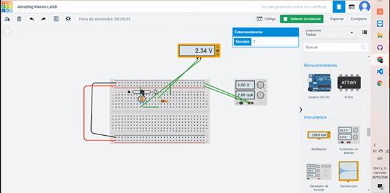
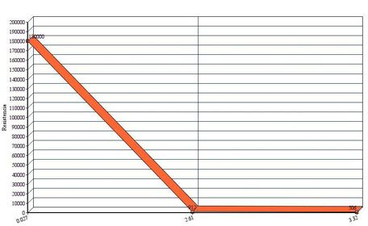
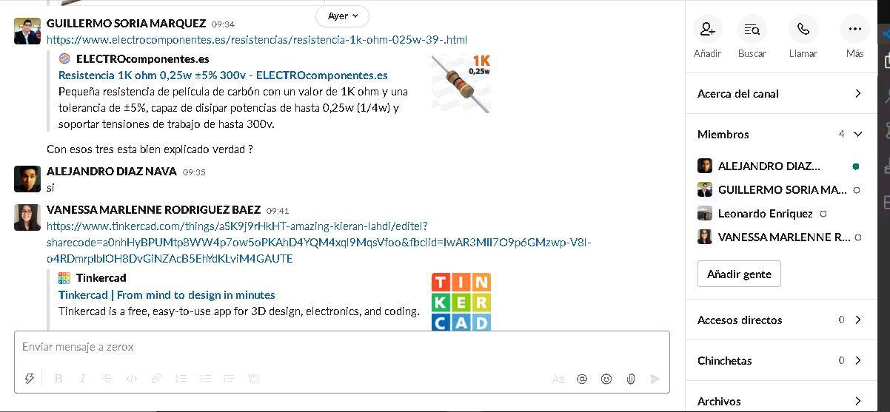
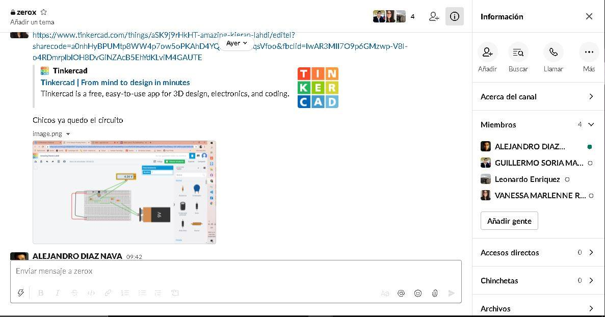
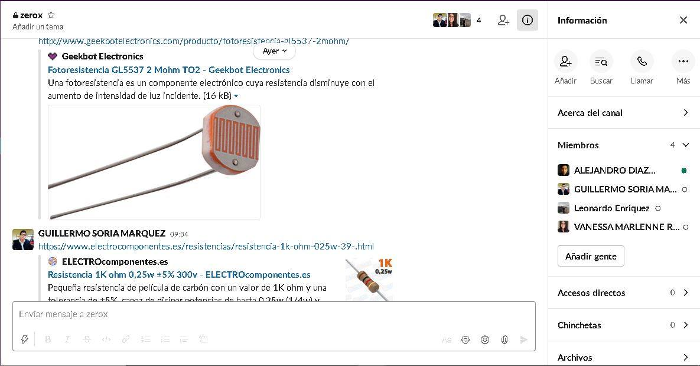
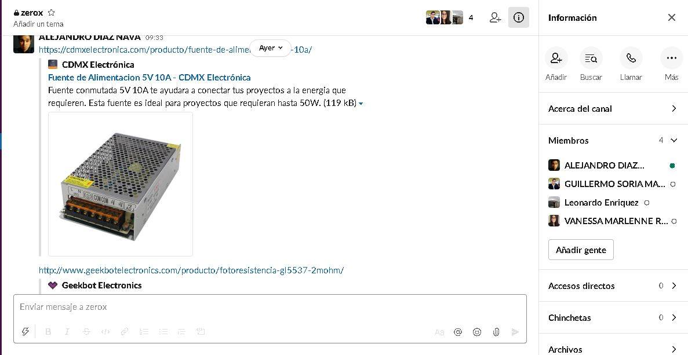
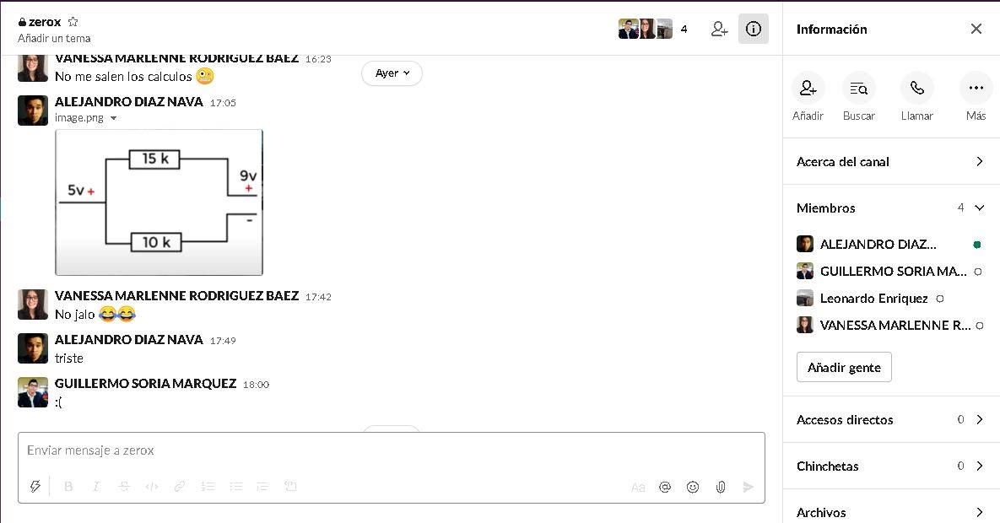
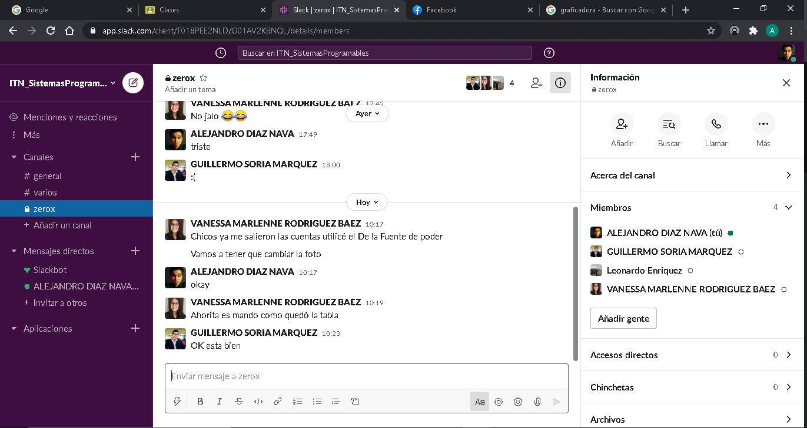

# Introducción

## :trophy: A.1.2 Actividad de aprendizaje

## Objetivo

Realizar un sensor medidor de luz (lux) a través de un circuito electrónico, utilizando un simulador, y  un **LDR (Light dependent 
Resistor)**.

### :blue_book: Instrucciones

- Se sugiere para el desarrollado de la presenta actividad, utilice uno de los siguientes simuladores: [Autodesk Tinkercad](https://www.
tinkercad.com/), [Virtual BreadBoard](http://www.virtualbreadboard.com/), [Easy EDA](https://easyeda.com/) por lo cual habrá que 
familiarizarse antes, e incluso instalarse o registrarse dentro de la plataforma.
- Toda actividad o reto se deberá realizar, utilizando el estilo **MarkDown con extension .md** y el entorno de desarrollo VSCode, 
debiendo ser elaborado como un documento **single page**, es decir si el documento cuanta con imágenes, enlaces o cualquier documento 
externo debe ser accedido desde etiquetas y enlaces, y debe ser nombrado con la nomenclatura **A1.2_NombreApellido_Equipo.pdf.**
- Es requisito que el .MD contenga una etiqueta del enlace al repositorio de su documento en GITHUB, por ejemplo **Enlace a mi GitHub** y 
al concluir el reto se deberá subir a github.
- Desde el archivo **.md** exporte un archivo **.pdf** que deberá subirse a classroom dentro de su apartado correspondiente, sirviendo 
como evidencia de su entrega, ya que siendo la plataforma **oficial** aquí se recibirá la calificación de su actividad.
- Considerando que el archivo .PDF, el cual fue obtenido desde archivo .MD, ambos deben ser idénticos.
- Su repositorio ademas de que debe contar con un archivo **readme**.md dentro de su directorio raíz, con la información como datos del 
estudiante, equipo de trabajo, materia, carrera, datos del asesor, e incluso logotipo o imágenes, debe tener un apartado de contenidos o 
indice, los cuales realmente son ligas o **enlaces a sus documentos .md**, _evite utilizar texto_ para indicar enlaces internos o externo.
- Se propone una estructura tal como esta indicada abajo, sin embargo puede utilizarse cualquier otra que le apoye para organizar su 
repositorio.
  
```
- readme.md
  - blog
    - C0.1_x.md
    - C0.2_x.md
  - img
  - docs
    - A0.1_x.md
    - A0.2_x.md
    - A1.2_x.md
    - A1.3_x.md
```


### :pencil2: Desarrollo

1. Utilice el siguiente listado de materiales para la elaboración de la actividad y agregue en la columna Fuente de consulta su enlace 
_bibliográfico_.

    | Cantidad | Descripción                      | Fuente de consulta |
    | -------- | -------------------------------- | ------------------ |
    | 1        | Sensor Fotoresistencia LDR de 2M |[GEEKBOT ELECTRONICS](http://www.geekbotelectronics.com/producto/fotoresistencia-gl5537-2mohm/)                   |
    | 1        | Resistencia 1k                   |[ELECTRO COMPONENTES](https://www.electrocomponentes.es/resistencias/resistencia-1k-ohm-025w-39-.html)                    |
    | 1        | Fuente de alimentación de 5v.    |[CDMX Electronica](https://cdmxelectronica.com/producto/fuente-de-alimentacion-5v-10a/)                   |

2. Considerando que el elemento LDR es un sensor fotoresistivo es decir varia su resistencia en base a la cantidad de luz que incide 
sobre el, **Que observa en el grafico siguiente?** 
   
<p align="center">
    
</p>


Cuanto mayor sea la intensidad de luz que incide en la superficie del LDR menor será su resistencia y en cuanto menor sea la luz que incida sobre éste mayor será su resistencia.


1. Ensamble el circuito que se muestra utilizado el simulador que halla considerado, colocando la fotorresistencia en la posición LDR y 
resistencia de acuerdo con la imagen del esquemático:

    <p align="center"> 
        
    </p>
4. coloque la imagen finalmente obtenida del circuito ensamblado dentro de su simulador.


1. Mida la **resistencia** de la fotorresistencia con el ohmetro bajo las siguientes condiciones: ausencia de luz u oscuridad,  luz 
ambiente, luz intensiva y registre en la tabla correspondiente.
6. Calcule el **valor de voltaje Vout teórico** para cada una de las condiciones antes indicadas asi como el valor de voltaje Vout 
medido  y registre en la tabla correspondiente.
7. Calcule el **valor de exactitud** de voltaje entre lo teórico y lo medido para cada condición  y registre en la tabla correspondiente.

    | Condicion          |  Impedancia en fotoresistencia | Voltaje Vout teórico | Voltaje Vout medido | %  V.Medido/ V.Teórico |
    | --------------- | ----------------------------- | -------------------- | ------------------- | ---------------------- |
    | Ausencia de luz | 180k  Ohms |0.027v| 27.7mV |1|
    | Luz ambiental   | 912 Ohms |2.61v|2.61 V|1|
    | Luz intensa     | 506 Ohms |3.32v |3.32 V|1|

8. **Grafique** a través de los valores registrados en la tabla anterior de tal manera que se pueda observar el comportamiento de la curva del componente LDR e **inserte la grafica**.
   

9.  Inserte imágenes de **evidencias** tales como son reuniones  de los integrantes del equipo realizadas para el desarrollo de la actividad.
    
**30/Sep/2020**







**1/Oct/2020**



1.  Incluya las conclusiones individuales y resultados observados durante el desarrollo de la actividad.
   
**Díaz Navarro Alejandro**

En cierto punto me fue un poco difícil saber como es el armado del circuito ya que no me encuentro muy familiarizado con el ensamblado de estos, uno de los puntos donde se batallo un poco fue en saber que tipo de fuente alimentaria al circuito, se utilizó una pila de 9V que fue reducida con a 5V a través de resistencias, al final se optó por mejor hacer uso de una fuente de alimentación donde se puede establecer de manera manual el voltaje que queremos que alimentara.
Con el desarrollo de esta práctica comprendí el uso que tiene la fotorresistencia, y como esta es afectada dependiendo de la cantidad de luz que influye sobre esta misma, de igual manera en un punto se utilizó un led para ver de manera visual qué es lo que pasaba realmente al momento que la luz le afectaba como a menor luz este prendida y al ir aumentando el nivel de exposición este iba disminuyendo hasta el punto de apagarse. Por otro lado también nos permitió conocer el uso de un simulador de circuitos en este caso el que se encuentra disponible en la página Tinkercad.

**Rodríguez Báez Vanessa Marlenne**

En la actualidad cada dia hay mas apartatos que incluyen las Fotoresistencias, Gracias a eso pueden crear aparatos que no se necesiten que una persona lo enciendan, lo hacen idependiente, en esta practiva aprendimos mas del funcionamiento de esta teniando unos problemas al momento de sacar los calculos de la impedancia y del voltaje con el multimetro, en la practica nos decia qu eteniamos que alimentar el circuito con 5 volts lo cual pensamos que un arreglo de resistencias seria la solucion pero no cuadraban las cuentas por lo que mejor utilizamos una fuente de energia y le pusimos los 5 volts y así nos comenzo a salir llas cuentas, Gracias a esta practica aprendi el como medir bien la fotoresistencia y el como graficarla.


**Soria Márquez Guillermo**

El objetivo principal de esta practica fue analizar y comprender cual es el 
funcionamiento de la fotoresistencia con la representacion del circuito
en el documento de la practica. Al principio tuvimos problemas con la fuente
de alimentacion ya que no habia una manera directa de poner los 5V solicitados
pero lo solucionamos con resistencias ,se nos presentaron problemas ya que no
estabamos familiarizados con el simulador, realizamos varios circuitos y al final 
obtamos por porner una fuente de poder. Al momento de realizar los calculos
nos salian valores muy distintos y despues de analizar por bastante tiempo el circuito
nos dimos cuenta de que estaba mal conectado, asi que por eso no nos salian los calculos
corregimos el error y ya eran datos exactos.Esta practica me ayudo mucho porque yo no
conocia este componente y sobre todo a familiarizarme mas con los circuitos ya que no
tengo mucho conocimiento en ellos.
### :bomb: Rubrica

| Criterios     | Descripción                                                                                  | Puntaje |
| ------------- | -------------------------------------------------------------------------------------------- | ------- |
| Instrucciones | Se cumple con cada uno de los puntos indicados dentro del apartado Instrucciones?            | 10      |  | 5 |
| Desarrollo    | Se respondió a cada uno de los puntos solicitados dentro del desarrollo de la actividad?     | 60      |
| Demostración  | El alumno se presenta durante la explicación de la funcionalidad de la actividad?            | 20      |
| Conclusiones  | Se incluye una opinión personal de la actividad  por cada uno de los integrantes del equipo? | 10      |

:house: [Link a Github](https://github.com/AlejandroDiaz96/SistemasProgramables2020)
