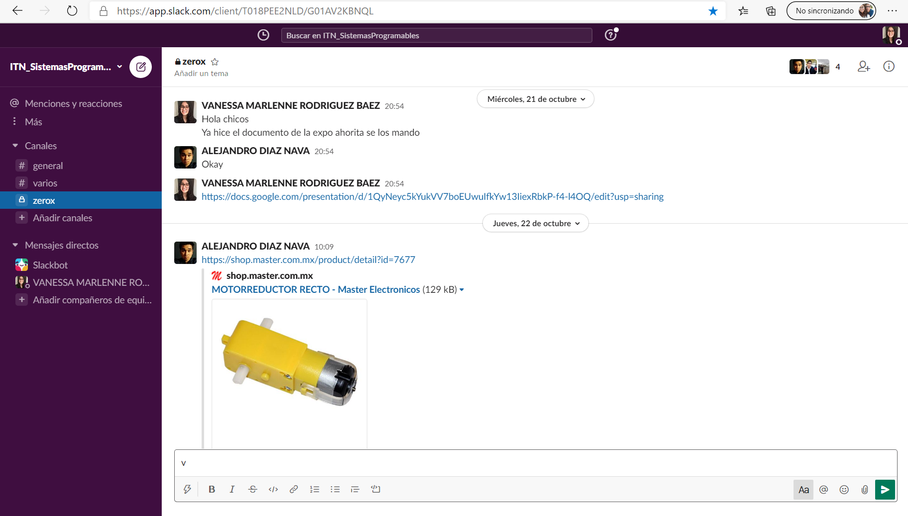
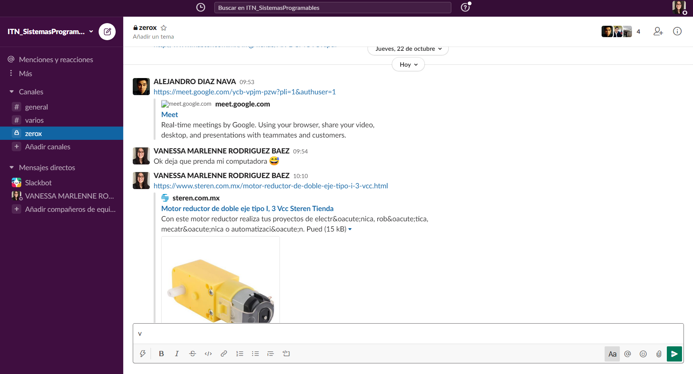
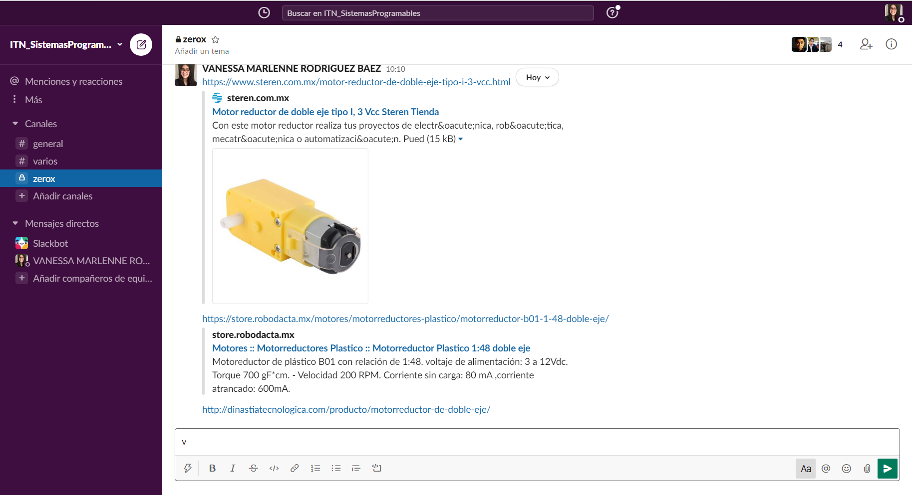

# Actuadores

## :trophy: A.2.1 Actividad de aprendizaje

**Tipos de actuadores eléctricos comerciales**

### :blue_book: Instrucciones

1. Cada equipo deberá elaborar su presentación de acuerdo con el modelo del actuador eléctrico que el asesor le indique.
2. Los temas deberán exponerse en clase por todos los integrantes evitando que se perciba la lectura del documento.
3. El tiempo máximo de la presentación deberá ser no mayor a 8 minutos.
4. La actividad será redactada utilizando el estilo ***markdown***.
5. El documento deberá incluir, los elementos indicados en la **rubrica** tales como son portada, introducción, desarrollo, conclusiones e información bibliográfica o enlaces utilizados.
6. El desarrollo deberá incluir características físicas y eléctricas, esquemático, usos aplicativos,  imágenes del actuador, asi como cualquier otra información que considere importante y que le pueda apoyar en el desarrollo de la exposición.
7. El documento deberá contar con la nomenclatura **A2.1_NombreApellido_Equipo**, y se deberá subir a la plataforma classroom en formato PDF dentro del apartado correspondiente a la actividad.
8. El documento elaborado para desarrollar la actividad será compartido en la plataforma colaborativa **GitHub**, dando acceso al asesor para su revisión.

### :pencil2: Desarrollo

1. Utilice el siguiente listado de modelos de actuadores electricos comerciales, para elaborar su actividad de acuerdo con las instrucciones solicitadas por el asesor.

   - [x] [Motor reductor de doble eje](https://articulo.mercadolibre.com.mx/MLM-651722486-motor-reductor-de-doble-eje-recto-3-vcc-mot-120-_JM?quantity=1#position=3&type=item&tracking_id=36396cb4-7b75-41a3-97e3-a0c6af6709c3) 
   - [ ] [Motor Unipolar paso a paso](https://articulo.mercadolibre.com.mx/MLM-587352935-motor-a-pasos-pm55l-048-unipolar-75-por-paso-con-cables-_JM?quantity=1#position=3&type=item&tracking_id=1a7ba1b9-b483-4d15-889f-2b970c4779c2) 
   - [ ] [Motor Bipolar paso a paso](https://articulo.mercadolibre.com.mx/MLM-783827003-motores-a-pasos-nema-23-bipolar-13kg-minebea-japones-arduino-_JM?quantity=1#position=2&type=item&tracking_id=f05c36d1-e3e0-4d19-b76e-8bbd132124fd) 
   - [ ] [Servomotor modelo SG90](https://articulo.mercadolibre.com.mx/MLM-618694358-micro-servomotor-sg90-robotica-arduino-16-kg-servo-motor-_JM?quantity=1&variation=23651072471#position=1&type=item&tracking_id=4b156b79-3721-4fc1-9ef0-4f378d92e1ef)

2. Espere a que el asesor le indique que tipo de sensor sera el que desarrollara su equipo y una vez que tenga marque el sensor dentro del punto anterior.
3. Una vez que conoce el tema a desarrollar, investigue y redacte dentro de este documento los puntos siguiente:

   - **Portada**, información del alumno, asesor, carrera, materia, fecha,..
   - **Introduccion**, una breve descripción de que tratara el tema.
   - **Desarrollo**
     - **Definición**.
     - **Imágenes** del actuador.
     - Características **físicas**.
     - Características **eléctricas**.
     - Explique cual el principio de funcionamiento.
     - Usos aplicativos.
     - Se puede apoyarse de un video que no debe durar mas de 1/3 del tiempo de su presentación..
    - **Conclusiones** por cada uno de los integrantes del equipo.
    - **Bibliográfia**, agregue dentro de este apartado toda bibliografia en la cual se apoyo para el desarrollo de la actividad, utilizando etiquetas y los enlaces. 
  - 
     [Presentacion PDF](https://github.com/AlejandroDiaz96/SistemasProgramables2020/blob/master/PDF/Motor%20reductor%20doble%20eje.pdf)

    ## **bibliográfias**
- [Definicion del motor](https://shop.master.com.mx/product/detail?id=7677)
- [Caracteristicas fisicas](https://shop.master.com.mx/product/detail?id=7677)
- [Caracteristicas electricas](https://www.steren.com.mx/motor-reductor-de-doble-eje-tipo-i-3-vcc.html)
- [Precio del producto](https://shop.master.com.mx/product/detail?id=7677)
- [Funcionamiento](https://shop.master.com.mx/product/detail?id=7677)
- [Aplicaciones](https://shop.master.com.mx/product/detail?id=7677)
- [Video de funcionamiento](https://www.youtube.com/watch?v=Jd2N_Wd7-cA&feature=youtu.be)
- [Video de aplicación](https://youtu.be/LkJkYZu-JwY)

  
1. Inserte imágenes de **evidencias** tales como son reuniones  de los integrantes del equipo realizadas para el desarrollo de la actividad

5. Incluya las conclusiones individuales y resultados observados durante el desarrollo de la actividad.

* **Diaz Navarro Alejandro 17210554**
Con esta investigación referente al motor de doble eje, puedo entender como en este modelo en específico estos funcionan dependiendo el voltaje que se le aplique y como este puedo ir variando de velocidad, así como su funcionamiento el cual depende de unos engranajes los cuales ocasionará que los ejes giren, de igual manera puede entender que significa la fuerza de torque que se refiere a la fuerza de giro en este caso es de 0.8 kg., gracias a la explicación de mi compañera supe que dependiendo de cómo se conecte el motor será el sentido en el que girara.

* **Rodríguez Báez Vanessa Marlenne 17210634**
Al abordar en este tema se pudo comprender más sobre el funcionamiento del motor reductor de doble eje, anteriormente había trabajado con el motor pero no sabía sus características ya sean físicas como eléctricas sólo sabía cómo actuaba en un proyecto, como todo motor existen muchos modelos el cual nosotros encontramos más fiable irnos por un modelo de motor pero en si todo era general en su funcionamiento, aplicaciones y hasta características. Decidimos incluir un video de un proyecto hecho en el semestre pasado para que sea más entendible dicho motor.

* **Soria Márquez Guillermo-17210648**
En esta presentación se trató el tema de Motor reductor de doble eje y todos los puntos vistos en la presentación  quedaron muy claros. Al momento de realizar la presentación encontramos varios modelos y no sabiamos cual elegir después de estar comparándolos decidimos tomar como base el motor AR-DC MOTOR pero en realidad pudimos haber tomado cualquiera ya que la información que encontramos era muy general, casi no encontramos características específicas de cada motor, por eso decidimos hacer una presentación más general.

### :bomb: Rubrica

| Criterios     | Descripción                                                                                  | Puntaje |
| ------------- | -------------------------------------------------------------------------------------------- | ------- |
| Instrucciones | Se cumple con cada uno de los puntos indicados dentro del apartado Instrucciones?            | 10      |  | 5 |
| Desarrollo    | Se respondió a cada uno de los puntos solicitados dentro del desarrollo de la actividad?     | 60      |
| Demostración  | El alumno se presenta durante la explicación de la funcionalidad de la actividad?            | 20      |
| Conclusiones  | Se incluye una opinión personal de la actividad  por cada uno de los integrantes del equipo? | 10      |

:house: [Link  Díaz Navarro Alejandro](https://github.com/AlejandroDiaz96/SistemasProgramables2020)

:house: [Link Rodríguez Báez Vanessa Marlenne](https://github.com/vanessamRodriguez/Sistemas_Programables)

:house: [Link Soria Márquez Guillermo](https://github.com/GuillermoSoria97/Sistemas_P)
