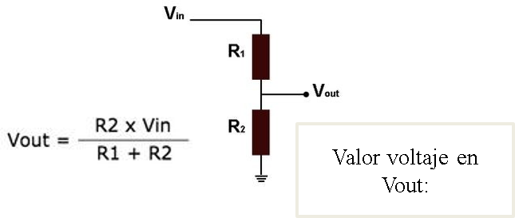

# Sensores

## :trophy: C1.3 Reto en clase

Circuito electrónico para uso con sensores y transductores

### :blue_book: Instrucciones
___

- De acuerdo con la información presentada por el asesor referente al tema sensores y transductores, contestar las preguntas indicadas dentro del apartado desarrollo.
- Toda actividad o reto se deberá realizar utilizando el estilo **MarkDown con extension .md** y el entorno de desarrollo VSCode, debiendo ser elaborado como un documento **single page**, es decir si el documento cuanta con imágenes, enlaces o cualquier documento externo debe ser accedido desde etiquetas y enlaces.
- Es requisito que el archivo .md contenga una etiqueta del enlace al repositorio de su documento en Github, por ejemplo **Enlace a mi GitHub**
- Al concluir el reto el reto se deberá subir a github el archivo .md creado.
- Desde el archivo **.md** se debe exportar un archivo **.pdf** con la nomenclatura **C1.3_NombreAlumno_Equipo.pdf**, el cual deberá subirse a classroom dentro de su apartado correspondiente, para que sirva como evidencia de su entrega; siendo esta plataforma **oficial** aquí se recibirá la calificación de su actividad por individual.
- Considerando que el archivo .pdf, fue obtenido desde archivo .md, ambos deben ser idénticos y mostrar el mismo contenido.
- Su repositorio ademas de que debe contar con un archivo **readme**.md dentro de su directorio raíz, con la información como datos del estudiante, equipo de trabajo, materia, carrera, datos del asesor, e incluso logotipo o imágenes, debe tener un apartado de contenidos o indice, los cuales realmente son ligas o **enlaces a sus documentos .md**, _evite utilizar texto_ para indicar enlaces internos o externo.
- Se propone una estructura tal como esta indicada abajo, sin embargo puede utilizarse cualquier otra que le apoye para organizar su repositorio.


```  
| readme.md
| | blog
| | | C0.1_x.md
| | | C0.2_x.md
| | | C0.3_x.md
| | img
| | docs
| | | A0.1_x.md
| | | A0.2_x.md
```

## :pencil2: Desarrollo

___

**Listado de preguntas**

1. Cual es la diferencia entre un sensor y un transductor?**Una de las diferencias significativas entre el sensor y el transductor es que el sensor detecta los cambios físicos ocurren en los alrededores mientras que la el transductor convierte la cantidad física o no eléctrica en otra señal o señal eléctrica.**
2. Cuales son los elementos importantes de un sensor? **Rango (valores entre los que puede medir),resolución (la variación mínima que puede detectar) y sensibilidad (lo que varía la magnitud de salida en relación con la variación de la magnitud medida).**

3. Que nombre recibe un elemento electrónico en el cual su valor de resistencia es dependiente de la cantidad de luz al que esta expuesto? **Fotoresistencia**
4. Calcular el valor de voltaje en Vout dado que R1=750 ohm, R2=100 ohm y Vin= 3.3v

* Vout= (100 ohms * 3.3v)/(750 ohms + 100 ohms)
Vout= (330)/(850)= **0.3882**



1. Que valor de Rango de impedancia se debería tener en R2 para que el rango de valor en Vout sea de 0 a 3.3V si Vin es de 5v y R1=750 ohms? Explique los cálculos realizados para obtener ese valor.

    Vout | R2 |
    ----|----|
    0 v | **1.5**|
    2.5 v | **750** |
    3.3 v | **1500** |
    
    * 1) **0V** 
     Vout = (1.5 ohms * 5V) / (750 ohm + 1.5 ohms)
     Vout = (7.5)/(751.5) = **0V**
     * 2) **2.5V**
     Vout = (750 ohms * 5V) / (750 ohms + 750 ohms)
     Vout = (3750) / (1500)= **2.5V**
      * 3) **3.5V**
     Vout = (1500 ohms * 5V) / (750 ohms + 1500 ohms) = **3.3V**  
     

___

### :bomb: Rubrica

| Criterios     | Descripción                                                                                  | Puntaje |
| ------------- | -------------------------------------------------------------------------------------------- | ------- |
| Instrucciones | Se cumple con cada uno de los puntos indicados dentro del apartado Instrucciones?            | 20 |
| Desarrollo    | Se respondió a cada uno de los puntos solicitados dentro del desarrollo de la actividad?     | 80      |

:house: [Ir a inicio](https://github.com/AlejandroDiaz96/SistemasProgramables2020)