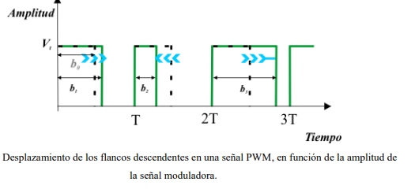

# Actuadores

## :trophy: C2.3 Reto en clase

**Circuito temporizador con circuito NE555**

### :blue_book: Instrucciones

- De acuerdo con la información presentada por el asesor referente al tema, elabore lo que se solicita dentro del apartado desarrollo.
- Toda actividad o reto se deberá realizar utilizando el estilo **MarkDown con extension .md** y el entorno de desarrollo VSCode, debiendo ser elaborado como un documento **single page**, es decir si el documento cuanta con imágenes, enlaces o cualquier documento externo debe ser accedido desde etiquetas y enlaces.
- Es requisito que el archivo .md contenga una etiqueta del enlace al repositorio de su documento en Github, por ejemplo **Enlace a mi GitHub**
- Al concluir el reto el reto se deberá subir a github el archivo .md creado.
- Desde el archivo **.md** se debe exportar un archivo **.pdf** con la nomenclatura **C2.3_NombreAlumno_Equipo.pdf**, el cual deberá subirse a classroom dentro de su apartado correspondiente, para que sirva como evidencia de su entrega; siendo esta plataforma **oficial** aquí se recibirá la calificación de su actividad por individual.
- Considerando que el archivo .pdf, fue obtenido desde archivo .md, ambos deben ser idénticos y mostrar el mismo contenido.
- Su repositorio ademas de que debe contar con un archivo **readme**.md dentro de su directorio raíz, con la información como datos del estudiante, equipo de trabajo, materia, carrera, datos del asesor, e incluso logotipo o imágenes, debe tener un apartado de contenidos o indice, los cuales realmente son ligas o **enlaces a sus documentos .md**, _evite utilizar texto_ para indicar enlaces internos o externo.
- Se propone una estructura tal como esta indicada abajo, sin embargo puede utilizarse cualquier otra que le apoye para organizar su repositorio.  
``` 
| readme.md
| | blog
| | | C2.1_x.md
| | | C2.2_x.md
| | | C2.3_x.md
| | img
| | docs
| | | A2.1_x.md
| | | A2.2_x.md
```

## :pencil2: Desarrollo

1. Investigue que es la modulación por ancho de pulso y para que sirve.


**Definicion:**
La modulación PWM es una técnica de modulación no lineal que presenta una secuencia
de pulsos rectangulares cuyo ancho depende del valor de amplitud de la señal
moduladora, (lo que se manifiesta por un ancho del pulso variable).



**USO:**
**En los motores**
* La modulación por ancho de pulsos es una técnica utilizada para regular la velocidad de giro de los motores eléctricos de inducción o asíncronos. Mantiene el par motor constante y no supone un desaprovechamiento de la energía eléctrica. Se utiliza tanto en corriente continua como en alterna, como su nombre lo indica, al controlar: un momento alto (encendido o alimentado) y un momento bajo (apagado o desconectado), controlado normalmente por relès (baja frecuencia) o MOSFET o tiristores (alta frecuencia).

**Como parte de un conversor ADC**
* Para un sistema digital, es relativamente fácil medir cuanto dura una onda cuadrada. Sin embargo, si no se tiene un conversor analógico digital no se puede obtener información de un valor analógico, ya que sólo se puede detectar si hay una determinada tensión, 0 o 5 voltios por ejemplo (valores digitales de 0 y 1), con una cierta tolerancia, pero no puede medirse un valor analógico.


1. Calcule el valor de C y R para obtener un valor de señal de 5 segundos para el siguiente circuito temporizador mono-estable.
2. Como se podrá observar la imagen anexa corresponde a un circuito temporizador,que terminal se tendría que utilizar para activar el temporizador? Cual terminal se utilizaría si se desea integrar un actuador eléctrico?

**Formula**
t=1.1 * R * C

**Datos:**
R=390k ohm
C=12 uF

**Desarrollo:**
t=1.1 * 390000 * 0.000012 = 5.148 segundos

Valor R | Valor C |
---------|----------|
390k Ohms  | 12 uf |

Basandome en la tablas de los valores comerciales de ambos componente, decidi utilizar los valores de 390k ohms y 12uf, ya que fueron las que mas se acercaban al valor solicitado.

1. Como se podrá observar la imagen anexa corresponde a un circuito temporizador,que terminal se tendría que utilizar para activar el temporizador? Cual terminal se utilizaría si se desea integrar un actuador eléctrico?

* Se debe utilizar la terminar trigger porque esto provocará el tiempo de retraso.

* Creo que este será el terminal 3 porque es la salida del temporizador 555, porque todo lo que se quiera agregar o controlar haciendo uso del temporizador está conectado a este terminal.
<p align="center">
    
</p>


### :bomb: Rubrica

| Criterios     | Descripción                                                                                  | Puntaje |
| ------------- | -------------------------------------------------------------------------------------------- | ------- |
| Instrucciones | Se cumple con cada uno de los puntos indicados dentro del apartado Instrucciones?            | 20 |
| Desarrollo    | Se respondió a cada uno de los puntos solicitados dentro del desarrollo de la actividad?     | 80      |

:house: [Link  Díaz Navarro Alejandro](https://github.com/AlejandroDiaz96/SistemasProgramables2020)